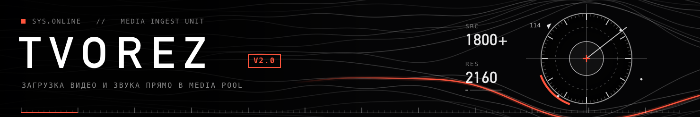

# TVOREZ — загрузчик медиа для DaVinci Resolve

Скрипт для DaVinci Resolve на macOS. Вставляешь ссылку — видео или звук
скачивается в рабочую папку и сразу появляется в Media Pool открытого проекта.
Не нужно ничего качать отдельно и перетаскивать руками.

Работает с YouTube, Instagram, TikTok, VK, Vimeo и ещё ~1800 сайтами
(внутри — [yt-dlp](https://github.com/yt-dlp/yt-dlp) и ffmpeg).

## Что умеет

- **Три режима:** видео со звуком (MP4), только видео без звука, только звук (WAV).
- **Качество:** 1080p или 720p в H.264 — Resolve открывает такие файлы везде и без тормозов;
  «Максимум» — до 4K в AV1.
- **Только отрезок:** указываешь «с 1:05 по 1:30», и скачивается только этот кусок.
- **Весь плейлист** одной ссылкой.
- **Сразу в Media Pool:** в отдельную папку (по умолчанию «Из интернета»),
  по желанию — сразу на таймлайн.
- **Рабочая папка** с подпапкой под каждый проект.
- **Вход через браузер** (Chrome, Safari и др.) — для Instagram и закрытых видео.
- **Автоконвертация:** то, что Resolve не читает (VP9, webm), перегоняется в HEVC/MP4.
- **Живой прогресс:** процент, скорость, оставшееся время; кнопка «Стоп».
- **История загрузок:** двойной клик — показать файл в Finder.
- **Кнопка «Обновить yt-dlp»** — если YouTube что-то поменял и загрузка перестала работать.

## Установка

Нужны macOS, DaVinci Resolve и [Homebrew](https://brew.sh).

Открой **Терминал**, вставь команду и нажми Enter:

```bash
curl -fsSL https://raw.githubusercontent.com/stcav1011/tvorez/main/install.sh | sh
```

Установщик положит скрипт в меню Resolve и поставит `yt-dlp` и `ffmpeg`.
Потом перезапусти DaVinci Resolve.

<details>
<summary>Через ZIP-архив</summary>

1. На странице репозитория: **Code → Download ZIP**, распакуй архив.
2. В Терминале (путь поправь, если распаковал в другое место):

   ```bash
   sh ~/Downloads/tvorez-main/install.sh
   ```
</details>

<details>
<summary>Установка вручную</summary>

```bash
brew install yt-dlp ffmpeg
```

Скопируй `tvorez.lua` в папку

```
~/Library/Application Support/Blackmagic Design/DaVinci Resolve/Fusion/Scripts/Utility/
```

и перезапусти Resolve.
</details>

## Как пользоваться

1. Resolve → **Workspace → Scripts → tvorez**.
2. Вставь ссылки — по одной на строку. Если ссылка уже в буфере обмена, она подставится сама.
3. Выбери формат и качество → **СКАЧАТЬ**.

Файлы окажутся в рабочей папке (по умолчанию `~/Movies/tvorez/<имя проекта>/`)
и в Media Pool, в папке «Из интернета».

## Если что-то не качается

- Нажми **«Обновить yt-dlp»** — сайты часто меняются, свежая версия обычно всё чинит.
- Для Instagram, закрытых и 18+ видео выбери браузер в строке **«Браузер»**:
  скрипт возьмёт вход оттуда. При первом разе macOS может спросить доступ к паролям —
  это нормально.
- Причина ошибки видна во вкладке **«Журнал»**.

## Где что лежит

| Что | Где |
| --- | --- |
| Скрипт | `~/Library/Application Support/Blackmagic Design/DaVinci Resolve/Fusion/Scripts/Utility/tvorez.lua` |
| Настройки, история, графика | `~/.tvorez/` |
| Скачанные файлы | рабочая папка, по умолчанию `~/Movies/tvorez/` |

Удаление: удалить `tvorez.lua` и папку `~/.tvorez`.

## Для разработки

`tvorez.lua` — собранный файл: код из `src/tvorez.src.lua` плюс графика из `src/assets`,
вшитая в base64, чтобы скрипт был одним файлом.

```bash
# перерисовать графику (шапка, стрелка, галочка)
swiftc -O src/hud.swift -o /tmp/hudgen && /tmp/hudgen src/assets

# собрать tvorez.lua
python3 src/build.py
```

Проверено на DaVinci Resolve Studio 21 и macOS на Apple Silicon.
